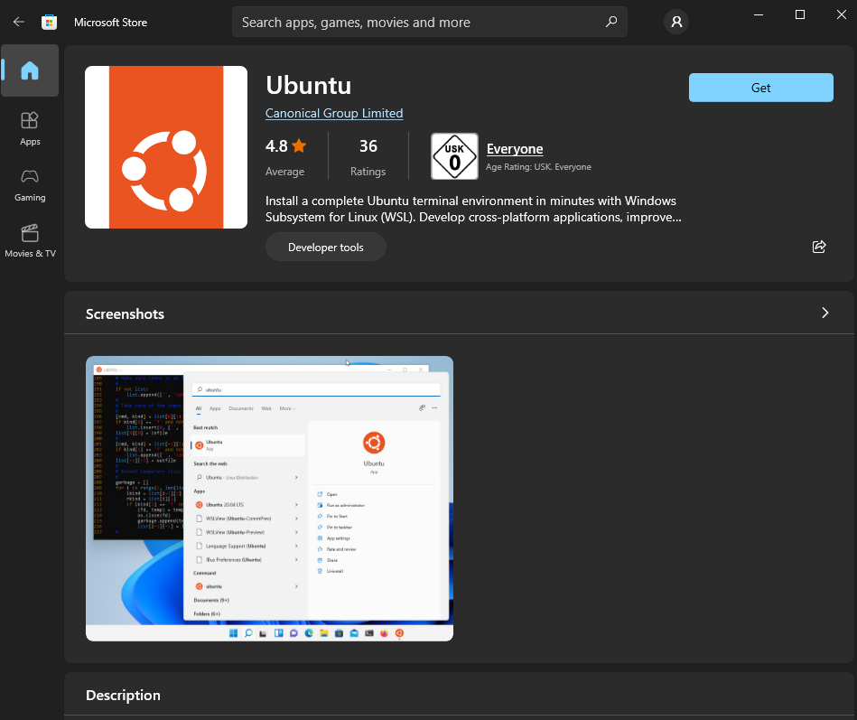
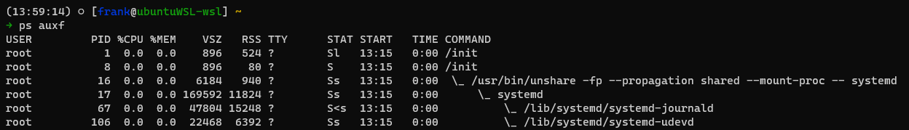
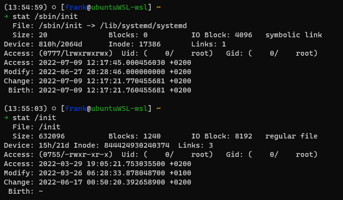
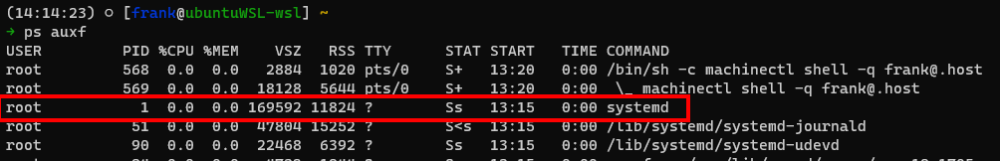
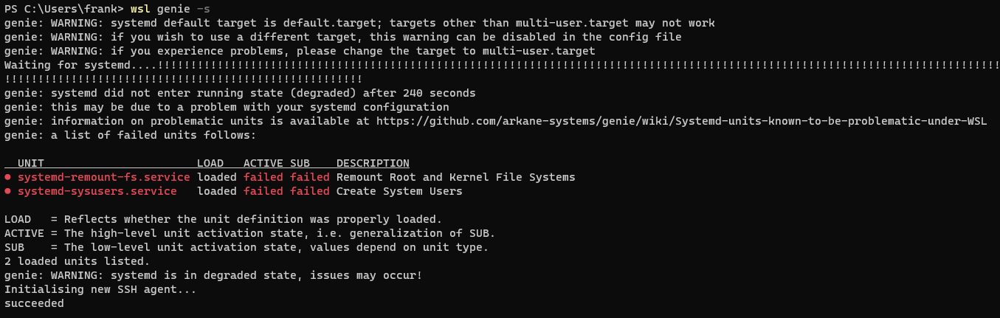
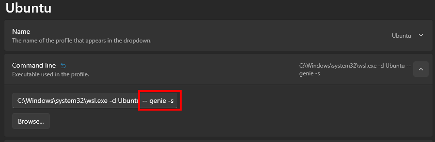

# Enabling systemd within WSL2

## Background

When using Windows, some people do not want to forgo nice and useful Linux tools. Thankfully, with Windows 10 Microsoft added the Windows Subsystem for Linux. The initial version was just some translation layer built by Microsoft, but with WSL 2 a full Linux kernel is running. 

Installing and running different distributions of Linux is now as simple as heading into the Microsoft store:

## Limitations

Even though a full kernel is running, there are some limitations. For example, interaction, especially incoming, between the virtual system and the outside world is not as straightforward ([allegedly](https://github.com/microsoft/WSL/issues/4150#issuecomment-1040877435), Microsoft is working on bridged networking to improve this).

Today I wanted to work around some of these issues by creating SSH tunnels between the host and virtual system (more about that in another article).

That was the moment I realized that systemd is not used as the init system, WSL2 appears to use its own init system which in turn utilizes systemd.

Therefore, simply using a systemd service to run my sshd is not possible. Or, is it...?

Fortunately, the community around both Windows and Linux is very strong so it is not surprising that there are ways to enable systemd within WSL.

## A genie bottle
 
A short Google search away I found https://github.com/arkane-systems/genie. 

I do not pretend to know what it is doing or how, but it appears to wrap the full Linux system within a systemd environment to provide the systemd process with PID 1:

### Installation

Installation of genie is straightforward and well described in the [readme](https://github.com/arkane-systems/genie#installation) of the repository.

### Testing WSL with genie

On the first start, it took a long time with a couple of units that failed to start

The [wiki](https://github.com/arkane-systems/genie/wiki/Systemd-units-known-to-be-problematic-under-WSL) of the repository has a list of units that are known to cause this together with the respective solutions.

In my case, both units that failed were listed there and the fix described worked nicely.

## Always start genie 

The genie wiki describes ways to always start genie on [every shell session](https://github.com/arkane-systems/genie/wiki/Automatically-starting-genie-on-every-shell-session). This ensures that no matter the way WSL is opened, genie is started if required.

Using genie has some implications on the PATH and environment variables that are available within WSL. These, along with solutions and workarounds, can also be found in the [wiki](https://github.com/arkane-systems/genie/wiki) of the repository.

### Windows Terminal

I exclusively use [Windows Terminal](https://apps.microsoft.com/store/detail/windows-terminal/9N0DX20HK701) to start WSL. In this case, always starting genie is easy without even touching the shell profile. Add the arguments required to the command line in the respective profile:

Using this way exclusively also avoids most (or all) of the PATH and environment issues mentioned in the wiki.
